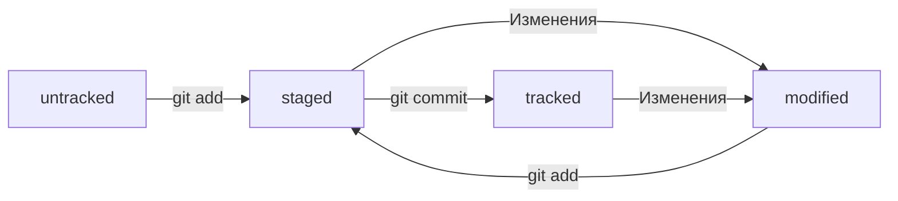

# Самая удобная шпаргалка по работе с Git
## Список команд
- `git init` - сделать папку Git-репозиторием
- `git status` - проверить статус, или состояние, репозитория
- `git add <название файла>` - подготовить файл к сохранению
- `git add --all` - подготовить к сохранению сразу все файлы
- `git add .` - добавить в репозиторий текущую папку со всеми файлами
- `git commit -m "<текст сообщения>"` - создание коммита с сообщением
- `git log` - просмотреть историю коммитов
- `git remote add` - привязать удаленный репозиторий к локальному
- `git remote -v` - убедиться, что репозитории связаны
- `git push` - отправить изменения на удаленный репозиторий

## Хеш - идентификатор коммита
Git преобразует информацию о коммитах с помощью алгоритма SHA-1 и для каждого из них рассчитывает уникальный идентификатор - хеш.
Хеш - основной идентификатор коммита и позволяет узнать его автора, дату и содержимое закоммиченных файлов.
Все хеши, а также таблицу соответствий `хеш → информация о коммите` Git хранит в папке `.git`.

Хеш обладает следующими важными свойствами:
- если хеш получить дважды для одного и того же набора входных данных, то результат будет гарантированно одинаковый;
- если хоть что-то в исходных данных поменяется (хотя бы один символ), то хеш тоже изменится (причем сильно).

## Исследуем лог
Как мы уже знаем, команда `git log` выводит список коммитов.

```bash
commit e83c5163316f89bfbde7d9ab23ca2e25604af290
Author: Linus Torvalds <torvalds@linux-foundation.org>
Date:   Thu Apr 7 15:13:13 2005 -0700

    Initial revision of "git", the information manager from hell
```

Разберем элементы, из которых состоит описание:
- строка из цифр и латинских букв после слова __commit__ - это хеш коммита;
- __Author__ - имя автора и его электронная почта;
- __Date__ - дата и время создания коммита;
- в конце находится сообщение коммита.

Командой `git log --oneline` можно получить сокращенный лог (выводятся первые несколько символов хеша каждого коммита и их комментарии).

## HEAD - всему голова

Файл `HEAD` - один из служебных файлов папки `.git`. Он указывает на коммит, который сделан последним (то есть на самый новый).

Многие команды Git принимают в качестве параметра хеш коммита. Если нужно передать последний коммит, то вместо его хеша можно просто написать слово `HEAD` - Git поймет, что вы имели в виду последний коммит.

## Статусы файлов в Git

Основные статусы:

- `untracked` (англ. "неотслеживаемый") - Git знает о существовании файла, но не следит за изменениями в нем.
- `staged` (англ. "подготовленный") - в этом состоянии находится файл после команды `git add`.
- `tracked` (англ. "отслеживаемый") - в него попадают файлы, которые уже были зафиксированы с помощью `git commit`, а также файлы, которые были добавлены командой `git add`.
- `modified` (англ. "измененный") - состояние, которое означает, что Git сравнил содержимое файла с последней сохраненной версией и нашел отличия.

### Типичный жизненный цикл файла в Git



1. Файл только что создали. Git еще не отслеживает содержимое этого файла. Состояние: `untracked`.
2. Файл добавили в staging area с помощью `git add`. Состояние: `staged` (+ `tracked`).
    - Возможно, изменили файл еще раз. Состояния: `staged`, `modified` (+ `tracked`).  
    Обратите внимание: `staged` и `modified` у одного файла, но у разных его версий.
    - Еще раз выполнили `git add`. Состояние: `staged` (+ `tracked`).
3. Сделали коммит с помощью `git commit`. Состояние: `tracked`.
4. Изменили файл. Состояние: `modified` (+ `tracked`).
5. Снова добавили в staging area с помощью `git add`. Состояния: `staged` (+ `tracked`).
6. Сделали коммит. Состояние: `tracked`.
7. Повторили пункты 4 -7 много-много раз.
